

| **** | <h1> Joshua Garvey</h1>
Annapolis, MD
 |   |
| ---------------------------------------------------------------------------- | ------------------------------------------- | ------------------------------------------------------------------------------------------------------------------------------------------------------------------------------------------------------------------------------------------------------------------------------------------------------------------------------ |

## My Website
### [JoshuaGarvey.com](https://joshuagarvey.com/)

  <a href="https://joshuagarvey.com/" target="_blank">
    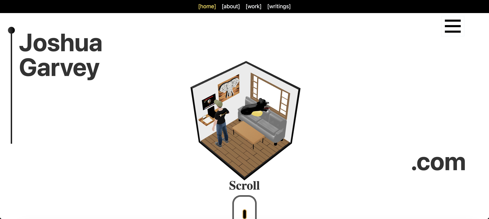
  </a>
  

    <a href="https://joshuagarvey.com/" target="_blank">
      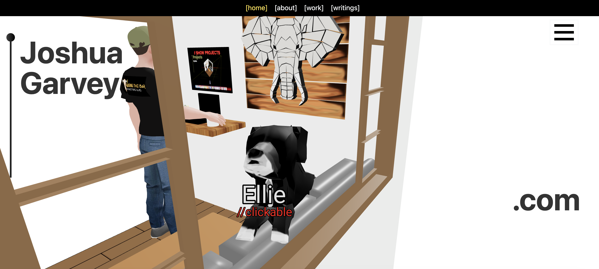
    </a>
    <a href="https://joshuagarvey.com/" target="_blank">
      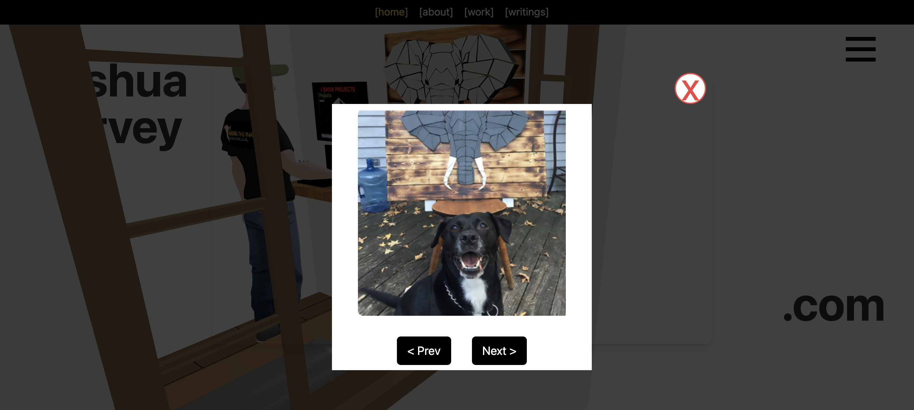
    </a>
  

## Projects - Reverse Chronological

### Cape St. Claire Web Application (July 2024 - September 2024)
<a href="https://www.capestclaire3d.com/" target="_blank">
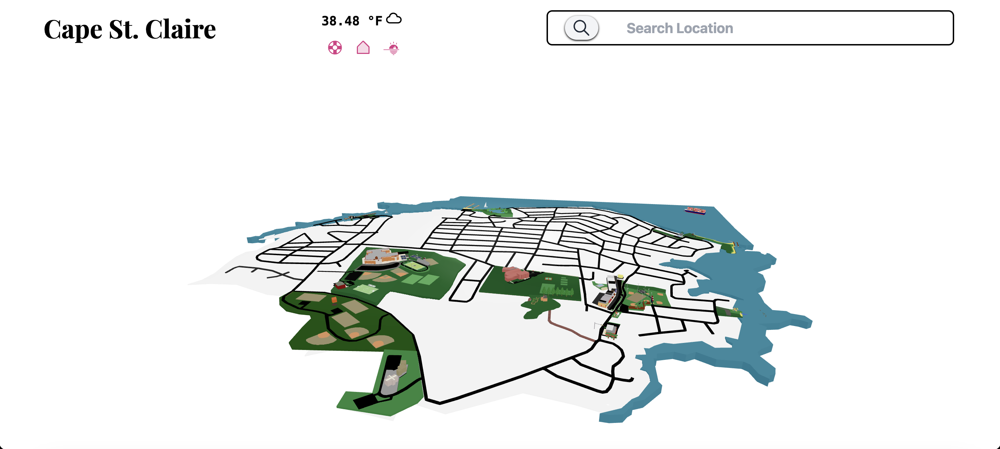  
</a>

- [Live Site](https://www.capestclaire3d.com/) | [Code Repository](https://github.com/Jgar514/cscapp)  
- Built a topographically accurate 3D model using OpenStreetMap GIS data and Blender.
- Developed React-based interactive mapping features.
---
### Webslinger NPM Package (June 2024 - July 2024)
<a href="https://youtu.be/Yp3bqXM4nm8?si=CVJWpfkz_gJMfW4a" target="_blank">
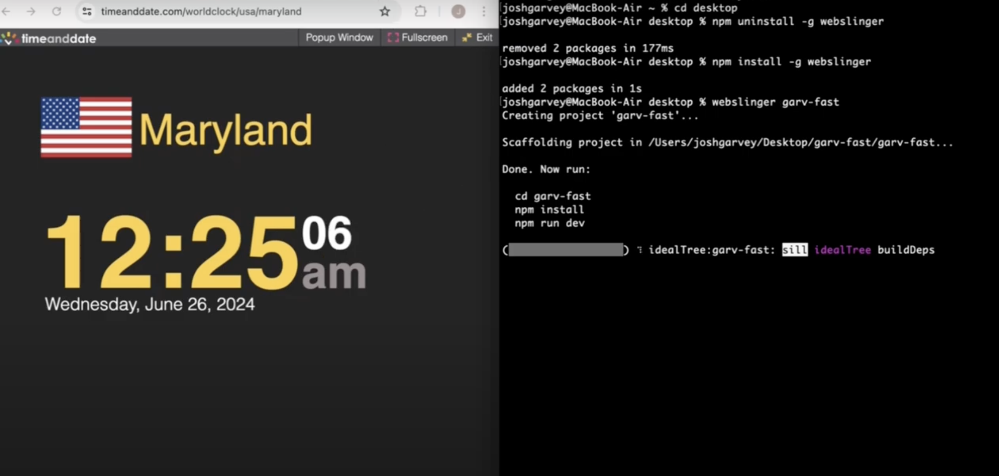  
</a>

- [NPM Package](https://www.npmjs.com/package/webslinger) | [Code Repository](https://github.com/Jgar514/npm) | [Video Demo](https://youtu.be/Yp3bqXM4nm8?si=CVJWpfkz_gJMfW4a)  
- Created a CLI tool to automate React project setup, GitHub repository creation, and Netlify deployment.
---
### Minimalistic Portfolio (May 2024)
<a href="https://all.joshuagarvey.com/" target="_blank">
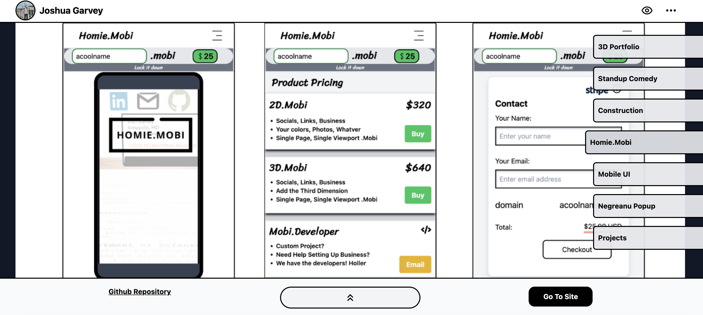  
</a> 

- [Live Site](https://all.joshuagarvey.com/) | [Code Repository](https://github.com/Jgar514/minportfolio)  
- A simple UI for showcasing previews of coding projects with **expandable/collapsible descriptions**.
- Used **React, Tailwind CSS, and JavaScript** for dynamic, conditionally rendered lists.
---
### Homie.Mobi (March 2024 - May 2024)
<a href="https://homie.mobi/" target="_blank">
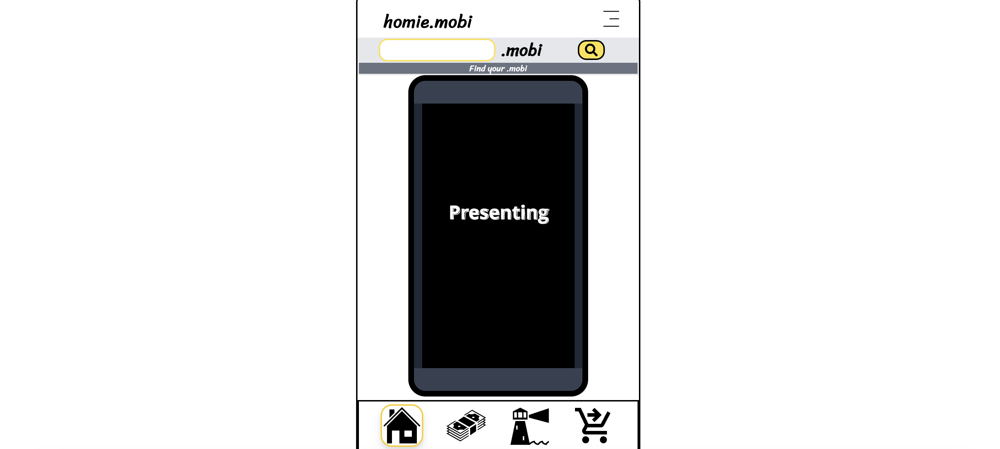  
</a> 

- [Live Site](https://homie.mobi/) | [Code Repository](https://github.com/Jgar514/Homie.Mobi)  
- Migrated Node.js/Express backend to Firebase, reducing operational costs by 95%.
- Built a domain search tool with real-time API checks and Stripe payment integration.
---
### William Montgomery Stand-up Comedy Website (February 2024)
<a href="https://thewilliammontgomery.show/" target="_blank">
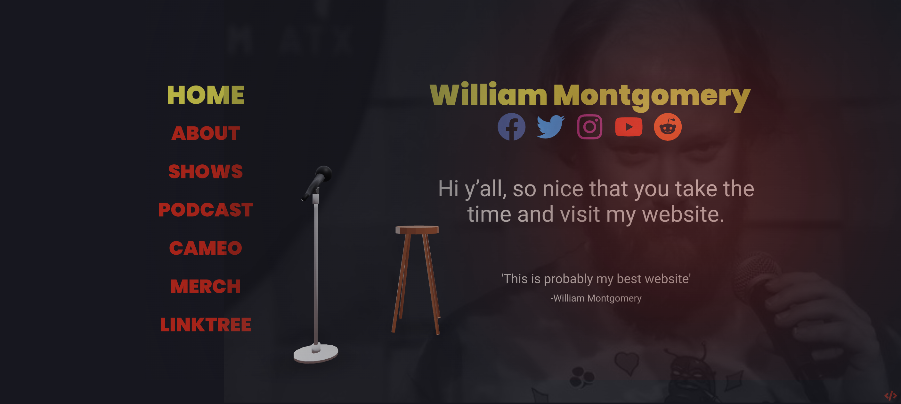  
</a> 
---
- [Live Site](https://thewilliammontgomery.show/) | [Code Repository](https://github.com/Jgar514/WilliamMontgomery)  
- Displayed a GLTF file in the browser to better market the comedian William Montgomery's brand.
- Successfully marketed the project, achieving **20,000 impressions** on posts showcasing the **3D stand-up scene**.
- Integrated social media icons to **centralize brand engagement**.
---
### Full Stack MERN Application (January 2024 - February 2024)

- [Code Repository](https://github.com/Jgar514/mern-azure)  
- Implemented authentication and password hashing using MongoDB, Express, React, and Node.js.
- Deployed on Microsoft Azure with CI/CD pipeline automation.
---
### General Contractor Website (October 2023 - November 2023)
<a href="https://blackline.joshuagarvey.com/" target="_blank">
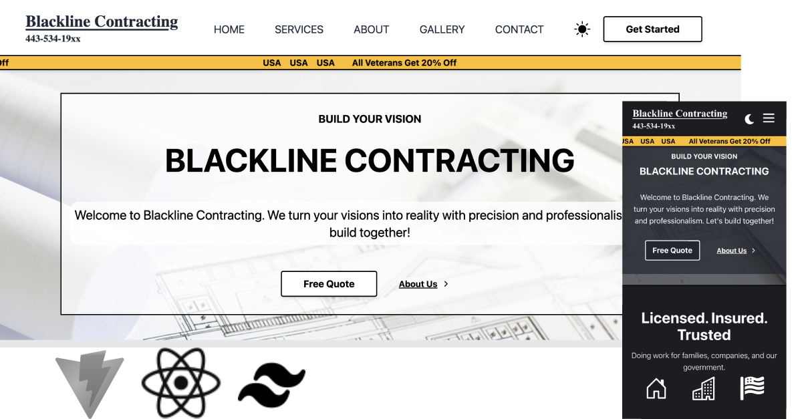  
</a>

- [Live Site](https://blackline.joshuagarvey.com/) | [Code Repository](https://github.com/Jgar514/blacklinecontracting.com)  
- Built a responsive business website with a dark theme toggle.
- Used JavaScript to dynamically display services from structured data.
---
### SPA Subdomain for Projects (September 2023)
<a href="https://projects.joshuagarvey.com/" target="_blank">
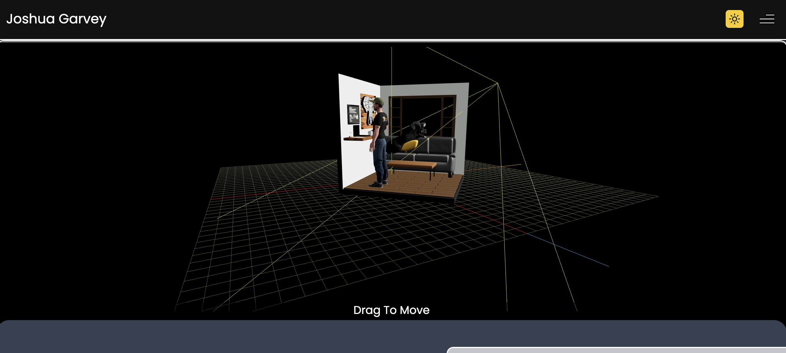  
</a> 

- [Live Site](https://projects.joshuagarvey.com/) | [Code Repository](https://github.com/Jgar514/subdomain_projects)  
- Built a **React Single Page Application (SPA)** with a **contact form**, portfolio of **coding projects**, and a **light/dark mode toggle** using React and Tailwind CSS.
---
### Mobile UI (August 2023 - September 2023)
<a href="https://ui.joshuagarvey.com/" target="_blank">
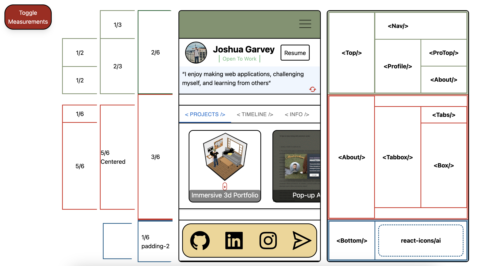  
</a> 

- [Live Site](https://ui.joshuagarvey.com/) | [Code Repository](https://github.com/Jgar514/mobileUI_subdomain_netlify)  
- Designed a mobile-optimized interface with tab boxes, sliders, and popup modals using React and Tailwind CSS.
---
### JavaScript Pop-up Advertisement (March 2023)
<a href="https://popup.joshuagarvey.com/" target="_blank">
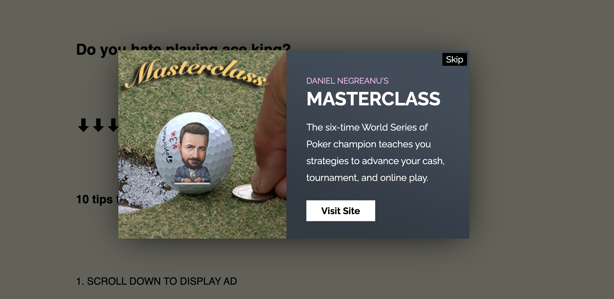  
</a> 

- [Live Site](https://popup.joshuagarvey.com/) | [Code Repository](https://github.com/Jgar514/subdomain_popup)  
- Created an event-driven popup system with conditional skip functionality.
---
### CSS Top Secret Mock Resume (February 2023)
<a href="https://jgar514.github.io/MockResume/" target="_blank">
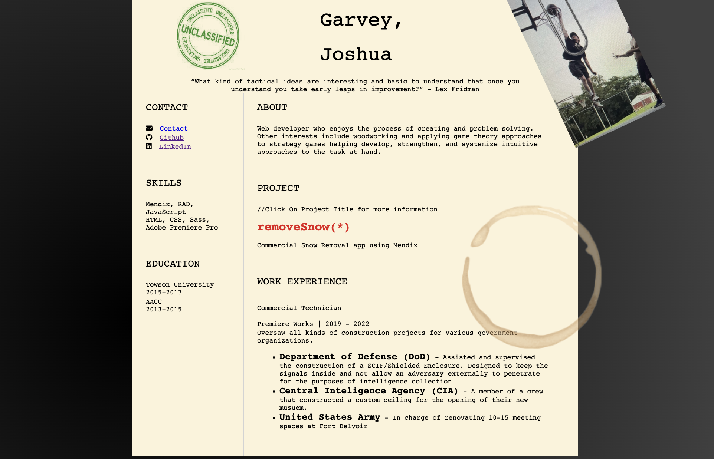  
</a> 

- [Live Site](https://jgar514.github.io/MockResume/) | [Code Repository](https://github.com/Jgar514/MockResume)  
- Built a single-page mock resume using HTML & CSS with a polished, responsive layout.
---
### removeSnow (January 2023)
<a href="https://www.youtube.com/watch?v=mOTKgQKJZSM" target="_blank">
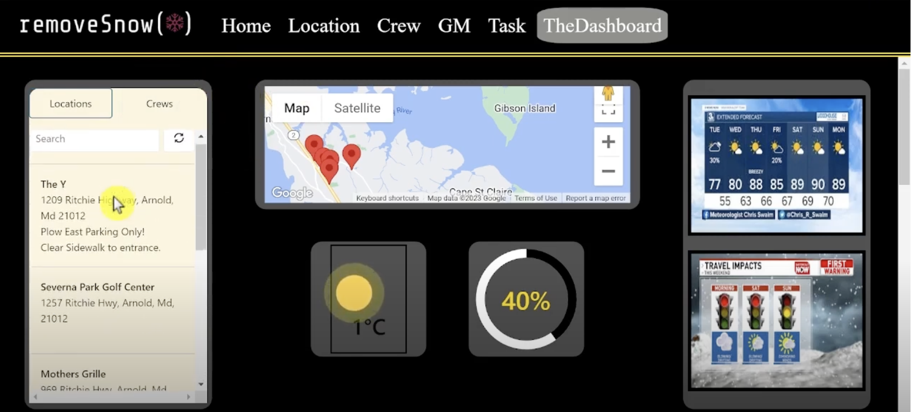  
</a>

- [Video Demo](https://www.youtube.com/watch?v=mOTKgQKJZSM) | [Code Repository](https://github.com/Jgar514/removeSnow)  
- Built a **snow removal company dashboard** while learning the low-code platform **Mendix**.
- Used Mendix to implement **widgets for displaying information** and **API integration**, such as **Google Maps**.
---
### Created First GitHub Repository (December 2022)

- **"Hello World"** 
   